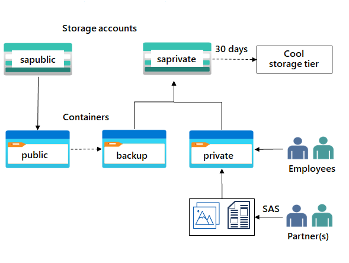

# Secure storage for Azure Files and Azure Blob Storage

## Learning objectives
In this module, you practice how to:

- Create and configure a storage account.
- Create and configure blob storage.
- Create and configure Azure Files.
- Configure encryption for storage.
- Configure networking for storage.

## Pre-requisites:

- Experience using the Azure portal to create resources.
- Basic knowledge of unstructured data like blobs and files.
- Basic knowledge of security concepts like identities, permissions, and encryption.
- Basic knowledge of networking concepts like virtual networks and subnetting.

## Exercises:

The module is divided into five exercises, each covering a specific storage scenario. The exercises are:

- Exercise 1 - Provide storage for the IT department testing and training,
- Exercise 2 - Provide storage for the public website,
- Exercise 3 - Provide private storage for internal company documents,
- Exercise 4 - Provide shared file storage for the company offices, and
- Exercise 5 - Provide storage for a new company app.

## Skills and Topics:

## Background

Task 1:

- Establish a naming convention.
- Create a storage account.
- Configure basic settings for security and networking.

Task 2:

- Create a storage account with anonymous public access.
- Create a blob storage container.
- Enable soft delete and versioning.

Skilling tasks
- Create a storage account with high availability.
- Ensure the storage account has anonymous public access.
- Create a blob storage container for the website documents.
- Enable soft delete so files can be easily restored.
- Enable blob versioning.

## Exercise - Provide private storage for internal company documents

### Skilling Tasks
**Baground**- The company needs storage for their offices and departments. This content is private to the company and shouldn’t be shared without consent. This storage requires high availability if there’s a regional outage. The company wants to use this storage to back up the public website.

- Create a storage account for the company private documents.
- Configure redundancy for the storage account.
Configure a shared access signature so partners have restricted access to a file.
- Back up the public website storage.
= Implement lifecycle management to move content to the cool tier.

